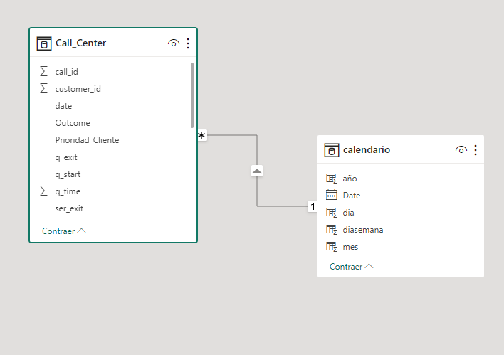
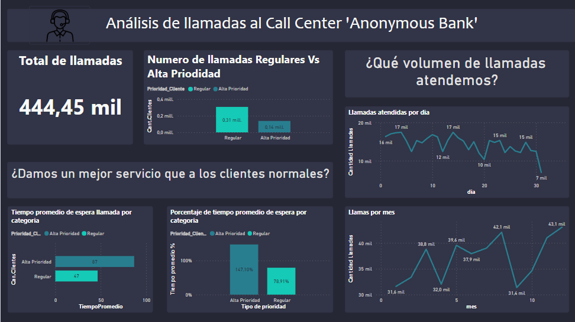
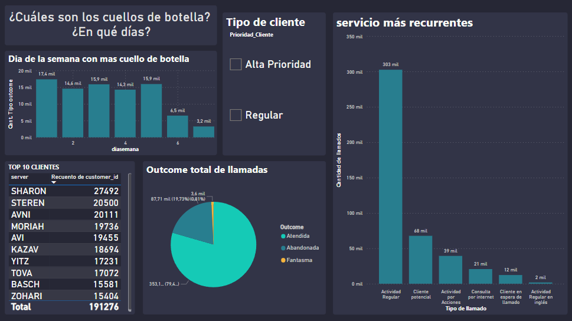

## Análisis de "Anonymous Bank" Call-Center DataSet

### Dataset
Este documento describe caso de negocio basado en un Call Center de un Banco: “Anonymous Bank” en Israel. El dataset contiene las llamadas registradas durante 12 meses (desde el 01/01/99 hasta el 31/12/99).

Este proyecto de análisis tiene como objetivo evaluar el rendimiento de un call center. Para ello, se utilizarán los datos de las llamadas entrantes al call center para crear visualizaciones que intenten responder a las siguientes preguntas:

- ¿Cuál es el nivel de servicio para los clientes Prioritarios?
- ¿Damos un mejor servicio que a los clientes normales?
- ¿Qué volumen de llamadas atendemos?
- ¿Cuáles son los cuellos de botella? ¿En qué días? ¿En qué bandas horarias?
- ¿Cómo es la eficiencia y productividad de nuestros agentes?
- ¿Hay clientes recurrentes en el uso del servicio?
- ¿Cuáles son los tipos de servicio más recurrentes?
- ¿Podemos estimar la dotación necesaria para cumplir con una calidad de servicio determinada?
- Para responder a estas preguntas, se realizarán los siguientes cambios en los datos:

## ETL - Limpieza, transformación y carga de datos

Se utilizo POWER BI para realizar la limpieza, transformacion y carga de datos.

Para este proceso tuve que investigar sobre cada columna y que valores representan integrados en el Archivos Word con una  breve explicacion de cada una, ademas se realizaron las siguientes modificaciones:

Se creo una columna priority_level que combine las prioridades 0 y 1 en una sola categoría llamada "Regular" y a las prioridades 2 seran llamadas "Alta prioridad".

Se creo una columna outcome_type que categorice los resultados de la llamada como "Atendida", "Abandonada" o "Fantasma".

Se creo una métrica tiempo_de_espera_en_cola_promedio que calcule el tiempo promedio que los clientes esperan en la cola.

Se agrupo los datos por fecha, hora, tipo de servicio y prioridad.

Ademas se creo una tabla Calendario para ayudarme con la segmentacion de dias por semana, mes, dia, etc

## Modelado de datos
Una vez efectuadas todas las transformaciones y normalizaciones en Power Query, procedimos a unir la tabla en la vista "Modelo" en donde como mencione anteriormente vincule las relaciones de las tablas por "Date"

## Visualización
El dashboard cuenta con 2 páginas navegables en la cual se intenta responder a la mayoria de las preguntas, en las siguientes podran encontrar:

Pag1:
- El numero total de llamadas al call center
- Comparacion entre los clientes regulares y los clientes de alta prioridad
- Una comparacion sobre el tiempo promedio de espera para el tipo de cliente, referenciando si cambia la prioridad con una comparacion porcentual incluida
- Volumen de llamadas en una linea temporal por dia
- Volumen de llamadas en una linea temporar por mes para ver si hay una  gran diferencia mes a mes

Pag2:
- Un grafico de barras agrupados por dia de semana referenciando que dia es el que hay mas abandonos de llamada por la larga espera
- Cuales son los top 10 clientes con mas llamados al call center
- Los tipos/motivos de llamada mas recurrentes
- Un selector para el tipo de cliente para poder hacer una mejor comparacion
- Un Piechart para comparar porcentualmente la totalidad del tipo de outcome en cada llamada

## Insights

A lo largo del trabajo de análisis, visualización y exploración de datos, arribamos a las siguientes conclusiones:

En ambos tipos de clientes (regulares  y Alta prioridad):

- Podemos decir que los meses no presentan una gran variación en cantidad de llamadas entre sí para ambos segmentos, pero podemos concluir que los meses de Marzo, Mayo, Junio, Julio, Agosto, Noviembre y Diciembre presentan llamadas que superan el promedio mensual y que por ende pueden considerarse como picos en el servicio

- La mayoría de las llamadas fueron por actividad regular o transaccional en español, seguidas de potenciales clientes y comercio de acciones. Las llamadas por motivos de actividad en internet no representaron una gran proporción (propio de la época) y las llamadas por actividad regular en inglés representaron el menor porcentaje.

- El 79% de las llamadas del año tuvo servicio, en tanto que el 20% fueron cortadas y solo en el 1% de las llamadas se ignoró lo sucedido.

- Los lunes (dia de semana 1) fue el dia mas colapsado en tiempo de espera promedio para clientes regulares

Para el segmento de alta priodidad:

- Representan La menor parte de los llamados con solamente 137.45 mil llamados del total y ademas tiene aproximadamente 12.910 clientes totales que sean alta prioridad

- Los picos de llamadas se registraron desde Marzo hasta Agosto y en Noviembre y Diciembre. El resto de meses las llamadas disminuyeron considerablemente por lo que resulta útil para el call center reforzar la contración de agentes en los meses de alta demanda.

- El tiempo de espera promedio para la alta priodidad es considerablemente mayor (el doble) comparado con los clientes regulares, Con un  tiempo promedio de espera de 80+ segundos de espera

- Los dias con alta cola de espera fue el dia de la semana 3 (miercoles) para los clientes de alta prioridad, al parecer simplemente no habia comparacion en la epoca o maneras viables de priorizar un tipo de cliente

